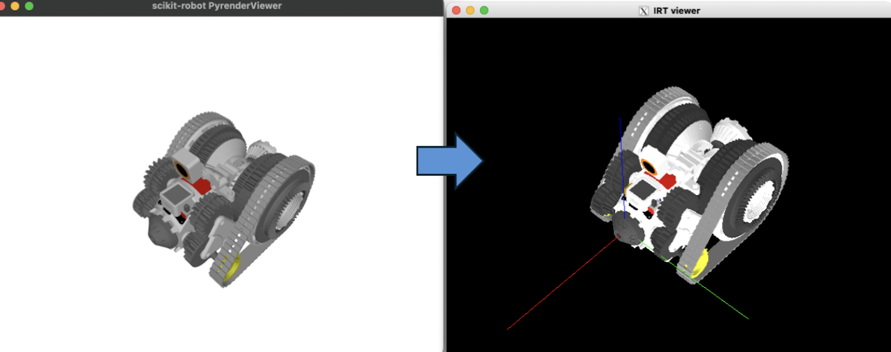

# urdfeus


[](https://github.com/iory/urdfeus/actions)

URDFファイルをEusLispコードに変換するPythonライブラリ

## 概要

`urdfeus`は、ロボット記述ファイル（URDF）をEusLispのロボットモデル定義に変換するツールです。ROS環境で使用されるURDFファイルを、EusLispプログラミング環境で利用できる形式に変換できます。



## インストール

```bash
pip install urdfeus
```

開発版をインストールする場合：

```bash
git clone https://github.com/iory/urdfeus.git
cd urdfeus
pip install -e .
```

## 使用方法

### コマンドライン

```bash
# 基本的な変換
urdf2eus robot.urdf robot.l

# YAMLファイルと一緒に変換
urdf2eus robot.urdf robot.l --yaml-path robot.yaml

# カスタムロボット名を指定
urdf2eus robot.urdf robot.l --name my_robot

# メッシュ簡素化オプション付き
urdf2eus robot.urdf robot.l --voxel-size 0.01
```

### Pythonスクリプト

```python
from urdfeus.urdf2eus import urdf2eus

# URDFファイルをEusLispに変換
with open('robot.l', 'w') as f:
    urdf2eus('robot.urdf', fp=f)

# YAMLファイルと一緒に変換
with open('robot.l', 'w') as f:
    urdf2eus('robot.urdf', 'robot.yaml', fp=f)

# カスタムロボット名を指定
with open('robot.l', 'w') as f:
    urdf2eus('robot.urdf', robot_name='my_robot', fp=f)
```

## EusLisp → URDF 変換 (eus2urdf)

`eus2urdf`は、EusLispのロボットモデルをURDF（ROSパッケージ形式）へ変換する逆方向のツールです。
モデルは`irteusgl`で実体化してから抽出するため、`:init`内で手続き的に追加されるリンク・関節（脚や吸盤など）も取りこぼさず変換できます。メッシュは`glvertices`から`trimesh`経由で書き出します（デフォルトは色を保持できる`.glb`）。

### 前提

- `irteusgl`（jskeus）がインストールされていること
- メッシュ書き出しに`trimesh` / `pycollada`（依存に含まれます）

### コマンドライン

```bash
# EusLispモデル -> ROSパッケージ一式 (package.xml + urdf/ + meshes/)
eus2urdf robot.l output_package_dir

# package:// で使うパッケージ名を指定
eus2urdf robot.l output_package_dir --package-name my_robot_description

# ロボット名・コンストラクタ・メッシュ形式を指定
eus2urdf robot.l out --name my_robot --constructor my-robot --mesh-format obj
```

生成物のレイアウト：

```
output_package_dir/
  package.xml
  urdf/<robot>.urdf          # package://<pkg>/meshes/<link>.glb を参照
  meshes/<link>.glb
```

### Pythonスクリプト

```python
from urdfeus.eus2urdf import eus2urdf

urdf_path = eus2urdf('robot.l', 'output_package_dir',
                     package_name='my_robot_description')
```

#### オプション

- `--package-name`: `package://`で参照するROSパッケージ名（既定は出力ディレクトリ名）
- `--name`: `<robot name>`とURDFファイル名（既定はモデルが返すロボット名）
- `--constructor`: EusLispのコンストラクタ関数名（既定はファイル名のstem）
- `--mesh-format`: `trimesh.export`が扱う拡張子（既定`glb`）。`glb`/`ply`/`obj`は面ごとの色を保持。`dae`はtrimeshのColladaエクスポータが色をtextureに潰すため**多色メッシュがグレーになる**（単色メッシュは保持）。`stl`は色なし
- `--irteusgl`: 使用する`irteusgl`実行ファイル

#### ジオメトリの扱い

- colladaボディは`glvertices`から、`make-cube`等で生成されたプレーンなbody（例：`:init`で追加される可視化用の脚キューブや吸盤）は各faceを三角形分割してメッシュ化します。いずれもメッシュとして書き出されます。
- プレーンbodyのface三角形分割は凸面を仮定します（プリミティブ形状では成立）。

### 生成されたEusLispファイルの使用

```lisp
;; EusLisp環境での使用例
(load "robot.l")
(setq *robot* (robot))  ; URDFのロボット名または--nameで指定した名前
(send *robot* :angle-vector)

;; カスタム名を指定した場合
(load "robot.l")
(setq *robot* (my_robot))  ; --name my_robot で生成した場合
(send *robot* :angle-vector)
```

### ロボット名の制約

`--name`オプションで指定するロボット名は、EusLispの識別子として有効である必要があります：

- 文字または`_`で始まる
- 文字、数字、`_`、`-`のみ使用可能
- EusLispの予約語（`if`, `defun`, `nil`など）は使用不可
- 空文字列やスペースを含む名前は使用不可

**有効な例**: `my_robot`, `robot-v1`, `MyRobot`, `_robot`, `robot123`
**無効な例**: `123robot`, `robot name`, `robot.name`, `if`, `defun`

## YAMLファイル

ロボットの関節グループ、エンドエフェクタ、初期ポーズを設定できます。

### PR2ロボットの設定例

実際の[PR2設定ファイル](https://github.com/iory/urdfeus/blob/main/tests/urdfeus_tests/pr2.yaml)を参考にした例：

```yaml
# 関節グループの定義
torso:
  - torso_lift_joint : torso-waist-z

larm:
  - l_shoulder_pan_joint   : larm-collar-y
  - l_shoulder_lift_joint  : larm-shoulder-p
  - l_upper_arm_roll_joint : larm-shoulder-r
  - l_elbow_flex_joint     : larm-elbow-p
  - l_forearm_roll_joint   : larm-elbow-r
  - l_wrist_flex_joint     : larm-wrist-p
  - l_wrist_roll_joint     : larm-wrist-r

rarm:
  - r_shoulder_pan_joint   : rarm-collar-y
  - r_shoulder_lift_joint  : rarm-shoulder-p
  - r_upper_arm_roll_joint : rarm-shoulder-r
  - r_elbow_flex_joint     : rarm-elbow-p
  - r_forearm_roll_joint   : rarm-elbow-r
  - r_wrist_flex_joint     : rarm-wrist-p
  - r_wrist_roll_joint     : rarm-wrist-r

head:
  - head_pan_joint  : head-neck-y
  - head_tilt_joint : head-neck-p

# エンドエフェクタ座標系
larm-end-coords: 
  parent : l_gripper_tool_frame
  rotate : [0, 1, 0, 0]

rarm-end-coords:
  parent : r_gripper_tool_frame
  rotate : [0, 1, 0, 0]

head-end-coords:
  translate : [0.08, 0, 0.13]
  rotate    : [0, 1, 0, 90]

# 事前定義ポーズ
angle-vector:
  reset-manip-pose : [300.0, 75.0, 50.0, 110.0, -110.0, -20.0, -10.0, -10.0, -75.0, 50.0, -110.0, -110.0, 20.0, -10.0, -10.0, 0.0, 50.0]
  reset-pose : [50.0, 60.0, 74.0, 70.0, -120.0, 20.0, -30.0, 180.0, -60.0, 74.0, -70.0, -120.0, -20.0, -30.0, 180.0, 0.0, 0.0]
```

### グループ定義の効果

YAMLファイルでグループを定義すると、EusLispで以下のようなメソッドが使用できるようになります：

```lisp
;; PR2ロボットの例
(setq *robot* (pr2))

;; 右腕の現在の関節角度を取得
(send *robot* :rarm :angle-vector)
;; => #f(-60.0 74.0 -70.0 -120.0 -20.0 -30.0 180.0)

;; 右腕の関節リストを取得
(send *robot* :rarm :joint-list)
;; => (#<rotational-joint r_shoulder_pan_joint> 
;;     #<rotational-joint r_shoulder_lift_joint> ...)

;; 関節名を取得
(send-all (send *robot* :rarm :joint-list) :name)
;; => ("r_shoulder_pan_joint" "r_shoulder_lift_joint" 
;;     "r_upper_arm_roll_joint" "r_elbow_flex_joint" ...)

;; 右腕の関節角度を設定
(send *robot* :rarm :angle-vector #f(0 0 0 -90 0 0 0))

;; 事前定義ポーズの使用
(send *robot* :reset-pose)
```

### 設定項目の詳細

#### 関節グループ
- `グループ名`: ロボットの部位名（rarm, larm, head など）
- `関節名 : EusLisp関節名`: URDFの関節名とEusLispでの関節名のマッピング

#### エンドエフェクタ座標系
- `parent`: 座標系を取り付ける親リンク名
- `translate`: [x, y, z] 平行移動（メートル単位）
- `rotate`: [x, y, z, angle] 回転軸ベクトルと角度（度単位）

#### 事前定義ポーズ
- `angle-vector`: ポーズ名と対応する関節角度リスト
- 関節角度は度単位で指定
- 関節の順序はYAMLファイル内の関節グループの定義順序に従う

## 依存関係

- Python 3.6+
- scikit-robot
- trimesh
- numpy

## ライセンス

MIT License

## 貢献

プルリクエストやイシューの報告を歓迎します。

## 関連プロジェクト

- [scikit-robot](https://github.com/iory/scikit-robot) - Pythonロボットモデリングライブラリ
- [EusLisp](https://github.com/euslisp/EusLisp) - Lispベースのロボットプログラミング言語